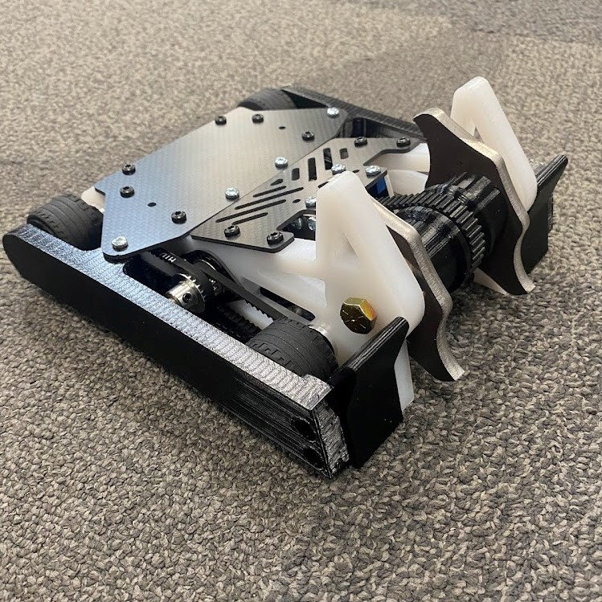
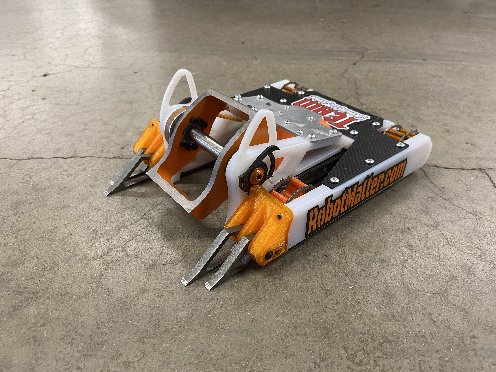
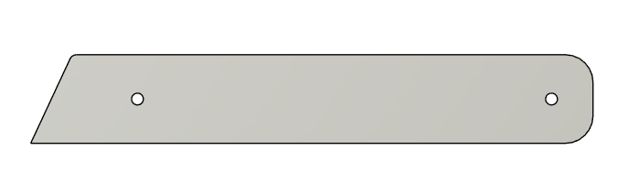

**Total Time spent: 36h**

---

## July 17, 2025

#Started research on NHRL and 3LB robots  

**Total Time spent: 2h**

After learning about Hackclub Highway, I have started to work towards my goal of building a Beetle weight battle bot. This idea came to mind months ago before halting my research due to other robotic competitions I have been involved in. During my time, today I had researched bots to give me inspiration for my robot. I've landed a final decision to do a vertical spinner with two separate blades, inspired by the Peter Bar Kit and one of the best bots, Lynx. After finding a bot to get inspired from, I looked into registration and events I could compete in.

# Peter Bar Kit

# LYNX

---

## July 18, 2025

#Started on Robot sketch 

**Total Time spent: 2h**

Once I had a robot design set in mind, it was finally time to sketch out parts of the robot. I decided to start with the frame first since its a priority to make it beofre adding anything else like the motors and blades. The entire base I wanted would be around 8 by 8 inches in order to make it stable in a boxy way.

# Inner Plate Sketch 1

# Inner Plate Sketch 2

---

## July 19, 2025

#Started making Sketch from 2D to 3D 

**Total Time spent: 2h**

After sketching out the inner plates, I extruded sketch to .5". The inner plates would be made out of HTPE material which is very strong and a light weight option for a beetle weight robot. Once completed, I created my outer armor plates which will hold my drive shafts and provide extra protection to my entire bot. The armor will be made out of PC (Polycarbonate) filament instead of HTPE as a TON of spares would be needed as it would take on hard hits.

# Inner Plate

# Outer Plate

---
