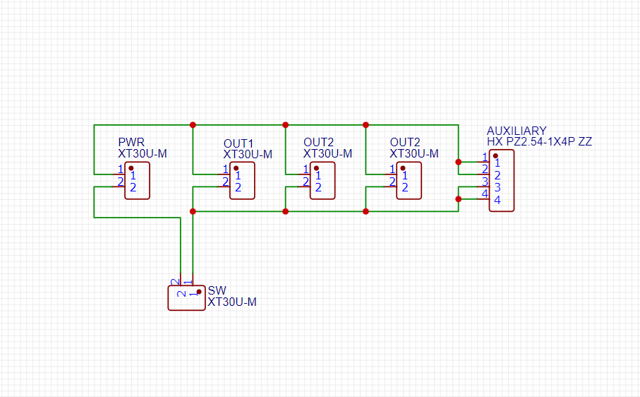

# Cheddar Shredder V2

---

## What is my project?
My project for Hackclub High way is a basic lynx inspired battle bot that will compete under the NHRL 3lb beetle weight class. With various known parts in the community I was able to put together a strong robot that will destroy anything in the arena.

## Why did I make this?
I am a student that is inspired by engineering, I come from a team in my school that competes under the First Tech Challenge competition hosted by FIRST. I have done a lot of cad over my high school years leading to my mostly experienced talet for engineering and mechanical. After regional champs for FTC, I was bored, I had nothing to do. I had talent for CAD and I wanted to do something that will keep me busy until the next season came, thats when I laid my eyes on NHRL. I was scrolling through my feed sometime during a random night when I stumbled upon a video of two robots fighting and I wondered to my self: How can I get involved? So I researched with my friend who had some prior experience to NHRL, and as the remainder of the year went on I started learning and seeing how people build their bots. But when I went to see the cost, it costed around 500 for a decent bot! Thats when I learned about hackclub highway, so I decided to spend half of my summer making and building a bot to which I would compete in NHRL around October.

## Cheddar Shredder (With Wheels)

 

## Cheddar Shredder (Shuffler Pod Drive)

 

## Power Distribution PCB

    

## PCB Schematic

## Wiring Diagram

## BOM

| Company        | Part                           | Cost Per Pcs | QTY | Total Cost | Link                                                                                                                                  |
| -------------- | ------------------------------ | ------------ | --- | ---------- | ------------------------------------------------------------------------------------------------------------------------------------- |
| **PARTS LEFT** |                                |              |     |            |                                                                                                                                       |
| RepeatRobotics | Weapon ESC                     | \$30         | 1   | \$30       | [Amazon](https://www.amazon.com/gp/product/B0DQKS5Z63?smid=A399B0GHKF2YQX&th=1)                                                       |
| PalmBeachBots  | Drive ESC                      | \$14         | 2   | \$28       | [PalmBeachBots](https://palmbeachbots.com/products/bl-heli-20a-brushless-speed-controller-reversing?_pos=7&_sid=327742323&_ss=r)      |
| RepeatRobotics | Drive Motor                    | \$45         | 2   | \$90       | [RepeatRobotics](https://repeat-robotics.com/buy/repeat-compact-1806/)                                                                |
| RepeatRobotics | Weapon Motor                   | \$20         | 1   | \$20       | [RepeatRobotics](https://repeat-robotics.com/buy/2836-beetle-brushless-motor/)                                                        |
| McMaster Carr  | 0.5" HDPE Material             | \$16.69      | 1   | \$16.69    | [McMaster](https://www.mcmaster.com/8619K471/)                                                                                        |
| Send Cut Send  | ALL CNC PARTS (STEEL BLADE)    | \$31         | 1   | \$31       | –                                                                                                                                     |
| Send Cut Send  | All CNC parts (CARBON FIBER)   | \$54         | 1   | \$54       | –                                                                                                                                     |
| RepeatRobotics | Needle Bearings                | \$6          | 2   | \$12       | [RepeatRobotics](https://repeat-robotics.com/buy/tc512-needle-thrust-bearing/)                                                        |
| RepeatRobotics | Needle Bearings                | \$3          | 2   | \$6        | [PalmBeachBots](https://palmbeachbots.com/products/sce55-needle-roller-bearing-3-pound-beater-bar-spares?_pos=3&_sid=d32c8aa0d&_ss=r) |
| McMaster Carr  | Lock Nuts                      | \$5.64       | 1   | \$5.64     | [McMaster](https://www.mcmaster.com/97135A225/)                                                                                       |
| McMaster Carr  | Weapon Shaft                   | \$12.49      | 1   | \$12.49    | [McMaster](https://www.mcmaster.com/91257A445/)                                                                                       |
| Amazon         | Battery                        | \$14.99      | 1   | \$14.99    | [Amazon](https://www.amazon.com/OVONIC-14-8V-130C-850mAh-Battery/dp/B0D3F6Z37F/)                                                      |
| JLCPCB         | Custom PCB (Power Distributor) | \$5          | 1   | \$5        | –                                                                                                                                     |
| —              | Shipping                       | —            | —   | \$23       | –                                                                                                                                     |
|                | **TOTAL**                      |              |     | **\$349**  |                                                                                                                                       |

